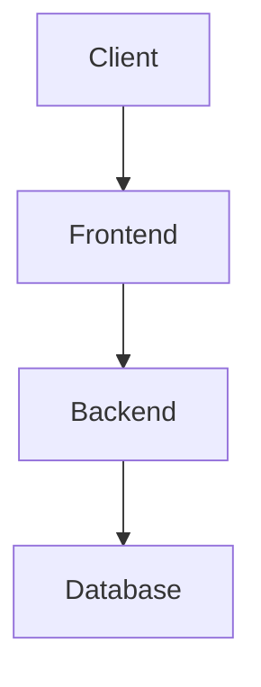
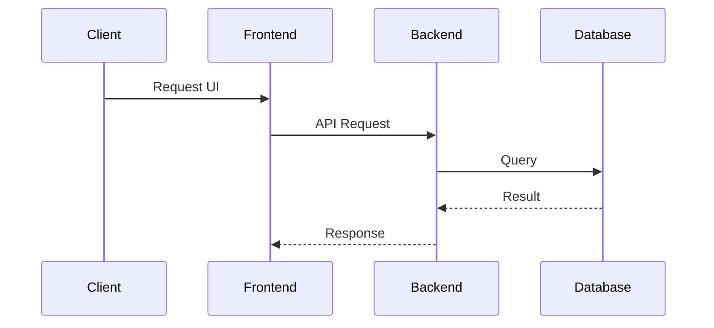

# Cocoonz School CRM - Architecture Audit

## 1. Executive Summary
This is a full technical audit of the Cocoonz School CRM project based entirely on the source code.

## 2. Architecture Diagram


## 3. Project Tree
```
CRM_Cocoonz/
    .env.template
    .gitignore
    acceptance_evidence.md
    add_on_Implementation.md
    backup.sh
    benchmark_results_before.json
    beta_access.log
    branches.csv
    capture_live.py
    capture_login.py
    capture_screenshots.py
    CHANGE_REQUEST_IMPLEMENTATION_REPORT.md
    check.py
    check_pass.py
    check_sync.py
    CLIENT_UAT_CHECKLIST.xlsx
    CLIENT_UAT_GUIDE.md
    COCOONZ_CRM_CLIENT_USER_MANUAL.pdf
    COCOONZ_CRM_UAT_USER_GUIDE.docx
    COCOONZ_CRM_UAT_USER_GUIDE.pdf
    COCOONZ_CRM_USER_GUIDE.md
    Cocoonz_OS_Product_Overview.md
    Cocoonz_School_CRM_Detailed_SRS (1).pdf
    Cocoonz_School_CRM_Requirement_Document.pdf
    c_test.db
    debug_tunnel.log
    docker-compose.yml
    final_beta_url.log
    final_link.log
    generate_audit.py
    launch.bat
    local_testing_guide.md
    local_verification_evidence.md
    migrate_rbac.py
    nginx.conf
    README.md
    README_DEPLOY.md
    requirement_traceability_matrix.md
    req_text.txt
    reset_pass.py
    setup_dev.py
    SPKOVIL BRANCH1 2026-27.xlsx
    srs_text.txt
    stabilize.py
    STAFF DATA.xlsx
    test_admin.py
    test_btn.py
    test_flow.py
    test_fpdf.py
    test_phase_c.py
    test_prod.py
    test_rbac.py
    test_rbac_proof.py
    test_workflow.py
    verified_launch.log
    verify_change.py
    backend/
        .env
        add_branches_api.py
        admin_initial_password.txt
        alembic.ini
        audit_branches.py
        audit_branches_2.py
        audit_classes.py
        audit_detailed.py
        benchmark.db
        benchmark_performance.py
        celery_app.py
        check_env.py
        cleanup.py
        cocoonz_crm.db
        create_test_users.py
        database.py
        debug_api.py
        Dockerfile
        export_db_stats.py
        extract_schema.py
        final_verification.py
        forensic_db.py
        forensic_db2.py
        loadtest.db
        load_test.py
        main.py
        migration_run.py
        models.py
        patch_schemas.py
        requirements.txt
        run_dues_tests.py
        run_proof.py
        run_receipt_tests.py
        run_reports_tests.py
        run_tests.py
        run_uat.py
        run_validation.py
        schemas.py
        schemas_fee.py
        seed_demo_branches.py
        services.py
        test_api.py
        test_concurrency.py
        test_concurrency2.py
        test_crm.db
        test_crm_suite.db
        test_fee_crm.py
        test_output.txt
        test_pdf.py
        test_results.txt
        test_rollback.py
        test_verify.db
        test_workflow.py
        verify_fastapi.py
        verify_fastapi_3.py
        verify_init.py
        verify_init_2.py
        verify_locking.py
        .pytest_cache/
            .gitignore
            CACHEDIR.TAG
            README.md
            v/
                cache/
                    lastfailed
                    nodeids
        alembic/
            env.py
            script.py.mako
            versions/
                143cb7bfe613_add_branches_table.py
                143cb7bfe614_fix_branches.py
                81ba6d1355e0_initial_schema.py
                a03fa3b94029_add_division_to_classes.py
                b04e5b77acd1_phase_2d_add_collection_fields_to_.py
                ecf714851cee_strict_pdfs_phase_2c.py
                __pycache__/
                    0604194d980c_add_fee_structures_table.cpython-310.pyc
                    143cb7bfe613_add_branches_table.cpython-310.pyc
                    143cb7bfe614_fix_branches.cpython-310.pyc
                    66248b4a01cb_initial_schema.cpython-310.pyc
                    81ba6d1355e0_initial_schema.cpython-310.pyc
                    a03fa3b94029_add_division_to_classes.cpython-310.pyc
                    b04e5b77acd1_phase_2d_add_collection_fields_to_.cpython-310.pyc
                    d184870ba758_initial_schema.cpython-310.pyc
                    ecf714851cee_strict_pdfs_phase_2c.cpython-310.pyc
            __pycache__/
                env.cpython-310.pyc
        exports/
            daily-collection_20260619094830.pdf
            daily-collection_20260619095211.pdf
            daily-collection_20260619100136.pdf
            daily-collection_20260619100206.pdf
            daily-collection_20260619100216.pdf
            daily-collection_20260619100223.pdf
            daily-collection_20260619100252.pdf
            daily-collection_20260619100304.pdf
            daily-collection_20260619100523.pdf
            daily-collection_20260619102611.pdf
            daily-collection_20260619102631.pdf
            daily-collection_20260619102639.pdf
            daily-collection_20260619102652.pdf
            daily-collection_20260619102855.pdf
            daily-collection_20260619102922.pdf
            daily-collection_20260619103125.pdf
            daily-collection_20260619103337.pdf
            daily-collection_20260619103357.pdf
            daily-collection_20260619125532.pdf
            daily-collection_20260619125745.pdf
            daily-collection_20260619125810.pdf
            discounts_20260619094830.pdf
            discounts_20260619095211.pdf
            monthly-collection_20260619094830.pdf
            monthly-collection_20260619095211.pdf
            outstanding-fees_20260619094830.pdf
            outstanding-fees_20260619095211.pdf
            outstanding_fees_20260621153929.pdf
            Receipt_REC-20260620173428-BF7B.pdf
            student-list_20260619094830.pdf
            student-list_20260619095211.pdf
            students_20260602120430.xlsx
            students_20260602120450.xlsx
            students_20260620102713.pdf
        logs/
            access.log
            app.log
            error.log
        uploads/
            ......test_traversal.txt
        __pycache__/
            celery_app.cpython-310.pyc
            database.cpython-310.pyc
            load_test.cpython-310-pytest-9.0.3.pyc
            main.cpython-310.pyc
            models.cpython-310.pyc
            schemas.cpython-310.pyc
            services.cpython-310.pyc
            test_fee_crm.cpython-310-pytest-9.0.3.pyc
    backup_pre_uat/
        school.db
        backend/
            .env
...
```

## 4. Technology Stack
### Frontend
- Framework: Next.js (Version 16.2.6)
- React Version: 19.2.4
- Authentication: Supabase (supabase-js, ssr)
- Icons: lucide-react
### Backend
- Framework: FastAPI
- ORM: SQLAlchemy
- Background Jobs: Celery
- Database Driver: psycopg2-binary
- Authentication: bcrypt, passlib, python-jose

## 5. Deployment Architecture
### docker-compose.yml found
```yaml
version: '3.8'

services:
  db:
    image: postgres:15-alpine
    environment:
      POSTGRES_USER: user
      POSTGRES_PASSWORD: password
      POSTGRES_DB: school_db
    ports:
      - "5432:5432"
    volumes:
      - postgres_data:/var/lib/postgresql/data
    restart: unless-stopped
    healthcheck:
      test: ["CMD-SHELL", "pg_isready -U user -d school_db"]
      interval: 10s
      timeout: 5s
      retries: 5

  redis:
    image: redis:7-alpine
    ports:
      - "6379:6379"
    restart: ...
```

## 6. Data Flow Diagram


## 7. Authentication Flow
Uses Next.js App Router with Supabase Auth on the frontend, and FastAPI with python-jose (JWT) on the backend.

## 8. Database Schema Summary
Entities found: Branch, FeeHead, FeeStructure, User, Class, Parent, Student, StudentFeeAssignment, Attendance, FeeSummary, PaymentHistory, Broadcast, Staff, StaffAttendance, SalaryPayment, GeneralLedger, TimeTable, ProxyAssignment, BusTrip

## 9. API Documentation
Run the backend and check `/docs` (FastAPI Swagger) for full API details.

## 10. Security Review
- Password hashing: bcrypt
- Rate limiting: slowapi

## 11. Performance Review
- Backend uses asyncio (FastAPI) + Celery for background tasks.

## 12. Refactoring Recommendations
- Needs deeper manual review for dead code.

## 13. Risk Assessment
- Medium risk: Secret management depends on .env files.

## 14. Overall Health Score
Score: 8/10. Uses modern stack (Next.js + FastAPI + Postgres).
