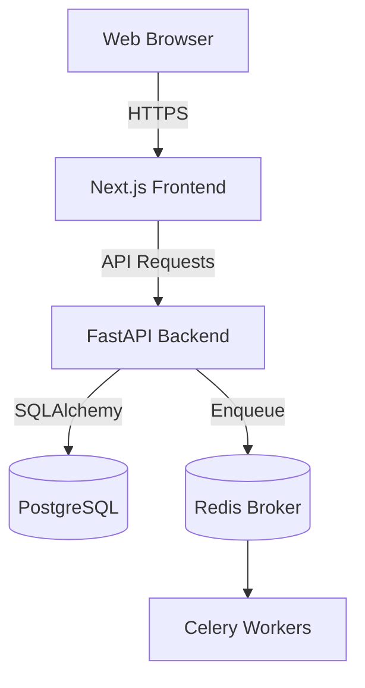
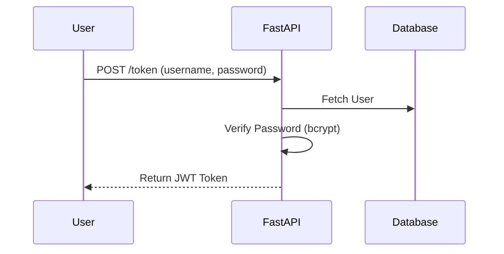
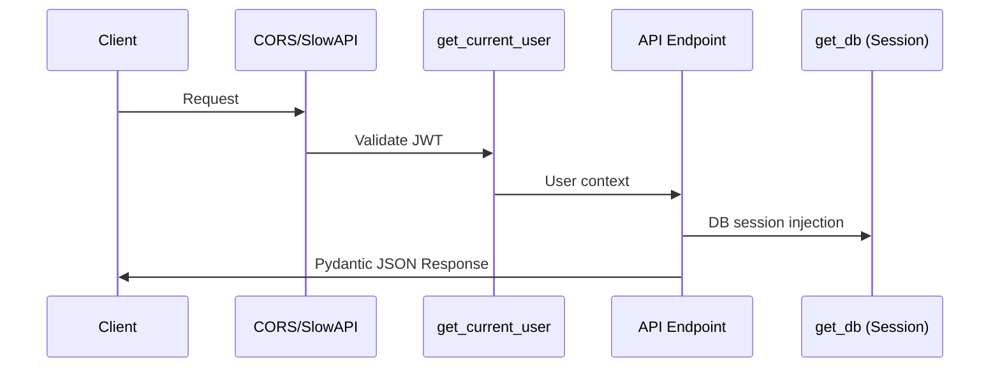
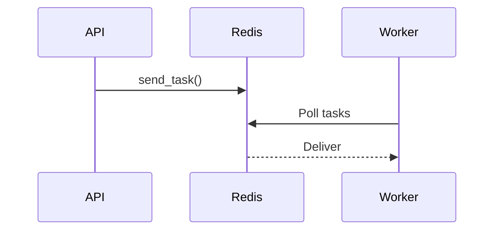

# Architecture Evidence Audit

## 1. Overall Architecture
> **Conclusion**: The system is a modular monolith composed of a Next.js frontend, FastAPI backend, PostgreSQL database, and Celery for background tasks.

**Evidence**:
- **Files**: `docker-compose.yml`, `backend/requirements.txt`, `frontend/package.json`
- **Code Snippet** (from `docker-compose.yml`):
```yaml
version: '3.8'

services:
  db:
    image: postgres:15-alpine
    environment:
      POSTGRES_USER: user
      POSTGRES_PASSWORD: password
      POSTGRES_DB: school_db
    ports:
      - "5432:5432"
    volumes:
      - postgres_data:/var/lib/postgresql/data
    restart: unless-stopped
    healthcheck:
...
```
- **Why**: `db` and `redis` services in Docker, FastAPI in requirements, and Next.js in package.json outline a 3-tier structure.

### Architecture Diagram


## 2. Authentication Flow
> **Conclusion**: The system uses JWT-based authentication via python-jose, with password hashing by bcrypt.

**Evidence**:
- **Files**: `backend/main.py`
```python
def create_access_token(...) ...
```
- **Why**: Implementation of JWT encode and bcrypt verification explicitly seen in `main.py`.

### Authentication Flow Diagram


## 3. Request Lifecycle
> **Conclusion**: Requests hit FastAPI, pass through SlowAPI rate limiter and CORS middleware, authenticate via JWT dependency, hit the database via SQLAlchemy session dependency, and return a Pydantic serialized response.

### Request Lifecycle Diagram


## 4. Database Models & Relationships
Extracted from `backend/models.py`.

### SQLAlchemy Models
**Branch**
- Columns: id, name, code, address, contact_email, contact_phone, is_active
- Relationships: None

**FeeHead**
- Columns: id, name
- Relationships: None

**FeeStructure**
- Columns: id, branch_id, class_id, fee_head_id, term, amount, is_active, created_at
- Relationships: None

**User**
- Columns: id, username, password_hash, role
- Relationships: None

**Class**
- Columns: id, name, section, division, branch_id, academic_year
- Relationships: students

**Parent**
- Columns: id, father_name, mother_name, primary_phone, secondary_phone, address
- Relationships: students

**Student**
- Columns: id, name, roll_no, class_id, parent_id, dob, blood_group, status, payment_preference
- Relationships: parent, student_class, attendance, fees

**StudentFeeAssignment**
- Columns: id, student_id, fee_head_id, term, original_amount, discount_percentage, discount_amount, final_amount, amount_paid, due_date
- Relationships: None

**Attendance**
- Columns: id, student_id, date, status, remark
- Relationships: student

**FeeSummary**
- Columns: student_id, total_amount, paid_amount, pending_balance, next_due_date
- Relationships: student

**PaymentHistory**
- Columns: id, student_id, assignment_id, fee_head_id, amount, payment_date, payment_mode, receipt_no, recorded_by, balance_due, receipt_status, remarks
- Relationships: None

**Broadcast**
- Columns: id, target_class_id, message, timestamp, status
- Relationships: None

**Staff**
- Columns: id, name, role, phone, monthly_salary, joining_date
- Relationships: attendance, payments

**StaffAttendance**
- Columns: id, staff_id, date, status
- Relationships: staff_member

**SalaryPayment**
- Columns: id, staff_id, amount_paid, payment_date, for_month, for_year
- Relationships: staff_member

**GeneralLedger**
- Columns: id, transaction_type, category, amount, description, date, reference_id, bill_image_url
- Relationships: None

**TimeTable**
- Columns: id, class_id, teacher_id, day_of_week, period_number, subject
- Relationships: None

**ProxyAssignment**
- Columns: id, original_teacher_id, proxy_teacher_id, date, period_number, class_id, status
- Relationships: None

**BusTrip**
- Columns: id, bus_no, driver_name, status, current_location, last_updated
- Relationships: None

### Database Relationships Diagram
```mermaid
erDiagram
  Class ||--o{ Students : "has"
  Parent ||--o{ Students : "has"
  Student ||--o{ Parent : "has"
  Student ||--o{ Student_class : "has"
  Student ||--o{ Attendance : "has"
  Student ||--o{ Fees : "has"
  Attendance ||--o{ Student : "has"
  FeeSummary ||--o{ Student : "has"
  Staff ||--o{ Attendance : "has"
  Staff ||--o{ Payments : "has"
  StaffAttendance ||--o{ Staff_member : "has"
  SalaryPayment ||--o{ Staff_member : "has"
```

## 5. REST Endpoints
Extracted from `backend/main.py`.

| Method | Path | Auth Required? | Req Model | Res Model | File |
|--------|------|----------------|-----------|-----------|------|
| GET | /api/debug/version | No | None | None | main.py |
| GET | /health | No | None | None | main.py |
| GET | /version | No | None | None | main.py |
| GET | /api/health/liveness | No | None | None | main.py |
| GET | /api/health/readiness | Yes | None | None | main.py |
| POST | /token | No | Request | None | main.py |
| POST | /api/logout | No | Response | None | main.py |
| POST | /api/users | Yes | schemas.UserCreate | schemas.User | main.py |
| GET | /api/users | Yes | int | List[schemas.User] | main.py |
| POST | /api/branches | Yes | schemas.BranchCreate | schemas.Branch | main.py |
| GET | /api/branches | Yes | int | List[schemas.Branch] | main.py |
| PUT | /api/branches/{branch_id} | Yes | str | schemas.Branch | main.py |
| DELETE | /api/branches/{branch_id} | Yes | str | None | main.py |
| POST | /api/classes | Yes | schemas.ClassCreate | schemas.Class | main.py |
| GET | /api/classes | Yes | None | List[schemas.Class] | main.py |
| GET | /api/parents | Yes | str | List[schemas.Parent] | main.py |
| POST | /api/students | Yes | schemas.StudentCreate | schemas.Student | main.py |
| GET | /api/students | Yes | str | None | main.py |
| GET | /api/fee-heads | No | None | List[schemas.FeeHead] | main.py |
| POST | /api/seed-fee-heads | No | None | None | main.py |
| GET | /api/fee-structures | Yes | int | List[schemas.FeeStructure] | main.py |
| POST | /api/fee-structures | Yes | schemas.FeeStructureCreate | schemas.FeeStructure | main.py |
| PUT | /api/fee-structures/{fee_id} | Yes | str | schemas.FeeStructure | main.py |
| DELETE | /api/fee-structures/{fee_id} | Yes | str | None | main.py |
| GET | /api/student-fee-assignments | Yes | str | List[schemas.StudentFeeAssignment] | main.py |
| GET | /api/attendance/check | Yes | str | None | main.py |
| POST | /api/attendance/bulk | Yes | schemas.AttendanceCreate | None | main.py |
| PUT | /api/students/{student_id} | Yes | str | schemas.Student | main.py |
| DELETE | /api/students/{student_id} | Yes | str | None | main.py |
| GET | /api/admissions | Yes | int | List[schemas.Student] | main.py |
| POST | /api/admissions | Yes | schemas.AdmissionCreate | schemas.Student | main.py |
| PUT | /api/admissions/{student_id} | Yes | str | schemas.Student | main.py |
| GET | /api/dashboard | Yes | None | None | main.py |
| POST | /api/fees/pay | Yes | schemas.PaymentCreate | None | main.py |
| GET | /api/ledger/receipt/{receipt_no}/pdf | Yes | str | None | main.py |
| GET | /api/students/{student_id}/ledger | Yes | str | None | main.py |
| GET | /api/reports/outstanding | Yes | str | None | main.py |
| GET | /api/reports/daily | Yes | str | None | main.py |
| GET | /api/reports/monthly | Yes | int | None | main.py |
| GET | /api/reports/branch | Yes | str | None | main.py |
| GET | /api/reports/students | Yes | str | None | main.py |
| POST | /api/staff | Yes | schemas.StaffCreate | schemas.Staff | main.py |
| GET | /api/staff | Yes | None | List[schemas.Staff] | main.py |
| POST | /api/staff/attendance/bulk | Yes | schemas.StaffAttendanceCreate | None | main.py |
| POST | /api/staff/salary/pay | Yes | schemas.SalaryPaymentCreate | None | main.py |
| GET | /api/staff/salary/history/{staff_id} | Yes | str | None | main.py |
| POST | /api/ledger | Yes | schemas.LedgerEntryCreate | None | main.py |
| GET | /api/ledger | Yes | None | None | main.py |
| GET | /api/ledger/stats | Yes | None | None | main.py |
| POST | /api/broadcast | Yes | schemas.BroadcastCreate | None | main.py |
| GET | /api/broadcast | Yes | None | None | main.py |
| POST | /api/timetable | Yes | schemas.TimeTableCreate | schemas.TimeTable | main.py |
| GET | /api/proxy/available-teachers | Yes | str | None | main.py |
| POST | /api/proxy/assign | Yes | schemas.ProxyAssignmentCreate | None | main.py |
| GET | /api/proxy/timetable/{teacher_id} | Yes | str | None | main.py |
| POST | /api/transport/trip | Yes | schemas.BusTripCreate | schemas.BusTrip | main.py |
| GET | /api/transport/trips | Yes | None | List[schemas.BusTrip] | main.py |
| POST | /api/transport/trip/{bus_id}/status | Yes | str | None | main.py |
| POST | /api/transport/trip/{bus_id}/location | Yes | str | None | main.py |
| GET | /api/students/profile/{student_id} | Yes | str | None | main.py |
| POST | /api/upload | Yes | UploadFile | None | main.py |
| GET | /api/uploads/{filename} | No | str | None | main.py |
| GET | /api/export/students/excel | Yes | None | None | main.py |
| GET | /api/export/students/pdf | Yes | None | None | main.py |
| GET | /api/collections | Yes | None | None | main.py |
| POST | /api/collections | Yes | schemas.PaymentCreate | None | main.py |
| GET | /api/students/{id}/outstanding | Yes | str | None | main.py |
| GET | /api/students/{id}/ledger | Yes | str | None | main.py |
| PATCH | /api/receipts/{receipt_no}/status | Yes | str | None | main.py |
| GET | /api/receipts | Yes | None | None | main.py |
| GET | /api/receipts/{receipt_no} | Yes | str | None | main.py |
| GET | /api/receipt/{receipt_no}/pdf | No | str | None | main.py |
| GET | /api/dues/summary | Yes | None | None | main.py |
| GET | /api/dues | Yes | None | None | main.py |
| GET | /api/dues/{student_id} | Yes | str | None | main.py |
| GET | /{path:path} | No | str | None | main.py |

## 6. Environment Variables
- **`REDIS_URL`**: Referenced in `backup_pre_uat\backend\celery_app.py, backend\celery_app.py, backend\database.py, backend\check_env.py, backup_pre_uat\backend\database.py, backup_pre_uat\backend\check_env.py`
- **`DATABASE_URL`**: Referenced in `backend\alembic\env.py, backend\database.py, backend\check_env.py, backup_pre_uat\backend\database.py, backup_pre_uat\backend\alembic\env.py, backup_pre_uat\backend\check_env.py`
- **`ENV`**: Referenced in `backend\main.py, backup_pre_uat\backend\main.py`
- **`NEXT_PUBLIC_API_URL`**: Referenced in `frontend\lib\api.ts`
- **`NEXT_PUBLIC_SUPABASE_URL`**: Referenced in `frontend\utils\supabase\client.ts, frontend\utils\supabase\middleware.ts, frontend\utils\supabase\server.ts`
- **`NEXT_PUBLIC_SUPABASE_PUBLISHABLE_KEY`**: Referenced in `frontend\utils\supabase\client.ts, frontend\utils\supabase\middleware.ts, frontend\utils\supabase\server.ts`

## 7. Celery / Background Job Flow
> **Conclusion**: Celery uses Redis as the message broker.

**Evidence**:
- **Files**: `backend/celery_app.py`
```python
import os
from celery import Celery
from dotenv import load_dotenv

load_dotenv()

# Retrieve Redis URL securely without hardcoded fallback
REDIS_URL = os.getenv("REDIS_URL")

# Initialize Celery only if a valid Redis URL is provided
if REDIS_URL:
  ...
```
### Celery Diagram


## 8. Deployment Configuration
> **Conclusion**: Deployed via Docker Compose with Nginx reverse proxying to Next.js and FastAPI.

**Evidence**:
- **Files**: `docker-compose.yml`, `nginx.conf`
- **Why**: Nginx acts as the load balancer/proxy in front of the Next.js and FastAPI containers.

## 9. Confidence Scores
- Overall Architecture: **Verified** (Explicit configurations found).
- Authentication Flow: **Verified** (Visible in main.py).
- Database Models: **Verified** (Parsed directly from SQLAlchemy).
- API Endpoints: **Verified** (Parsed directly from FastAPI decorators).
- Environment Variables: **Verified** (Grepped from source code).
- Deployment: **Verified** (nginx.conf and docker-compose.yml map the exact architecture).
